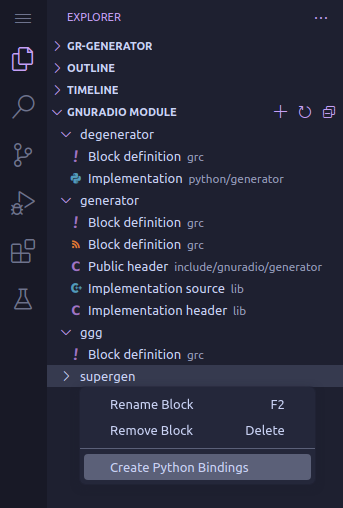
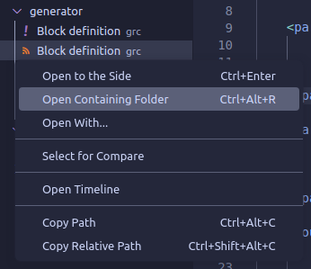
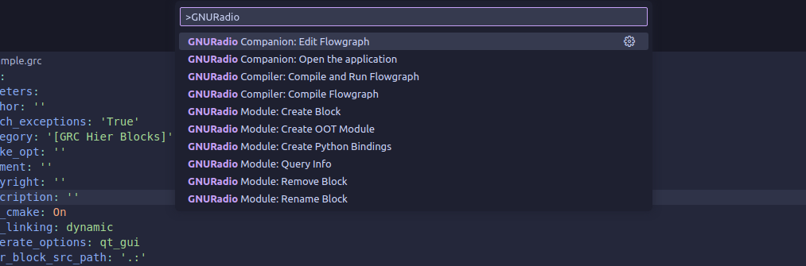
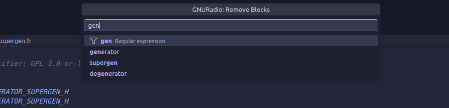
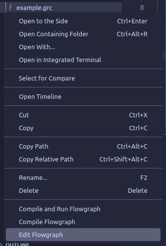
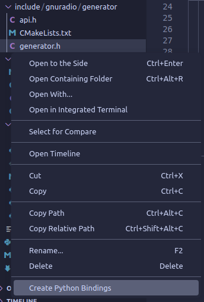
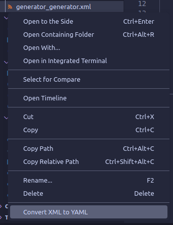
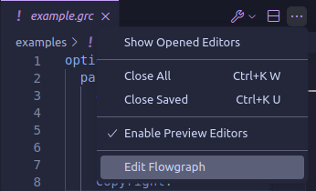
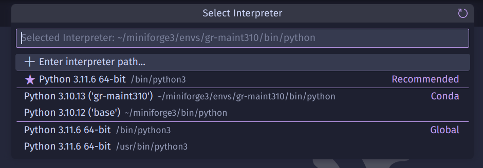

# GNURadio Integration

An extension to help you with work with [GNURadio](https://www.gnuradio.org) in VSCode.

Features:
- Opening and compiling GRC Flowgraph files (`.grc`)
- Browsing the OOT module to see all blocks and the corresponding files
- Manipulating the OOT module with `gr_modtool`

## OOT Module Explorer
If a GNURadio OOT module is detected in the workspace, the **GNURadio Module** tree view will appear in the Explorer container. All blocks within that module are presented with the corresponding files: YAML GRC block definition, Python implementation for Python blocks, C++ header and implementation for C++ blocks, Python and C++ QA (unit testing) source files.

 

## Commands
- **GNURadio Companion:**;
    - **Open the application**;
    - **Edit Flowgraph** - edit the selected GRC flowgraph file in GNURadio Companion application;
- **GNURadio Compiler**:
    - **Compile Flowgraph** ⚠️ - compile the selected GRC flowgraph file;
    - **Compile and Run Flowgraph** ⚠️ - compile and run the selected GRC flowgraph file.
- **GNURadio Module**:
    - **Create OOT Module**;
    - **Create Block**;
    - **Create Python Bindings** ⚠️ 🪣 - generate pybind11 code based on the block's C++ header;
    - **Rename Block**;
    - **Remove Blocks** 🪣;
    - **Convert XML to YAML** ⚠️ - convert old XML block definitions to YAML.
- **GNURadio Module View: Refresh**.

**Warning!** Commands marked with ⚠️ will overwite target files without confirmation!

## Command palette

**WIP**: Commands marked with 🪣 can use regular expressions to process multiple blocks at once. Picking the "Regular expression" option selects all blocks with names containing the fragment and any symbols before and after it (uses `.*{input}.*` when `{input}` is entered).  

## Explorer context menu
| Flowgraph | C++ block header | XML block definition |
|-|-|-|
|  |  |  |

## Editor title bar
| Flowgraph |
|-|
|  |

## GNURadio Prefix and Python Environment
If your GNURadio is not installed system-wide (e.g. from `apt`), then it might not be discoverable by the extension. To check if the installation is available, try running `gnuradio-config-info --prefix` in your terminal.

For [Conda-based installations](https://wiki.gnuradio.org/index.php?title=CondaInstall) you can use the VSCode Python extension (`ms-python.python`: [Open VSX Registry](https://open-vsx.org/extension/ms-python/python), [VS marketplace](https://marketplace.visualstudio.com/items?itemName=ms-python.python)) to activate your environment with GNURadio installation in it.  

When building from source on [Linux](https://wiki.gnuradio.org/index.php?title=LinuxInstall#From_Source), [Windows](https://wiki.gnuradio.org/index.php?title=WindowsInstall#Installation_Options) or [Mac OS](https://wiki.gnuradio.org/index.php?title=MacInstall#From_Source), you can select your install location. To make this installation available to the extension, you can set GNURadio Prefix through extension settings using the output of `gnuradio-config-info --prefix`.

If you don't use the VSCode Python extension, then you can point to your Python interpreter and libraries manually through extension settings.

## Extension settings
- **GNURadio Prefix**: absolute path to your GNURadio installation;  
Please use the output of `gnuradio-config-info --prefix`; see [InstallingGR](https://wiki.gnuradio.org/index.php?title=InstallingGR) for more details
- **Python** - for virtual environments:
  - **Default interpreter**: path to an executable (e.g. `~/.local/bin/python`);
  - **Default PYTHONPATH**: paths to library directories (e.g. `~/.local/lib/python3.11/site-packages`);
- **Check for XML block definitions** on startup (default: disabled).
