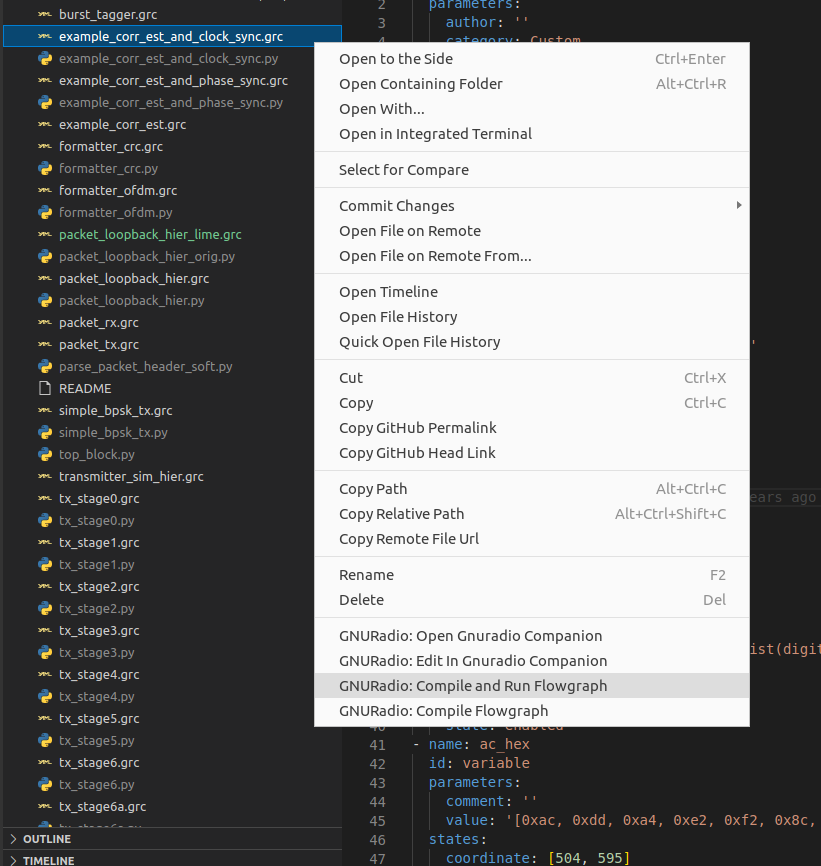

# GNURadio Integration 


An extension help you manipulating GNU Radio Companion files form in vsocde. Support "`.grc`" files.



## Explorer context menu

|No.|Name|Description|
|:---:|---|---|
|1|GNURadio: Open Gnuradio Companion|Open Gnurdaio Companion tool|
|2|GNURadio: Edit In Gnuradio Companion"|Open Gnuradio Companion tool with current flowgraph|
|3|GNURadio: Compile and Run Flowgraph|Compile and run current flowgraph|
|4|GNURadio: Compile Flowgraph|Compile current flowgraph`"|

## Properties

|No.|Name|Description|
|:---:|---|---|
|1|`gnuradio-integration.gnuradio-companion.cmd`|GNURadio Companiaon executable CLI command, default "`gnuradio-companion`"|
|2|`gnuradio-integration.grcc.cmd`|Gnuradio companion compiler command, default "`grcc`"|

```text
Compilation will overwite the target file without confirmation!
```
